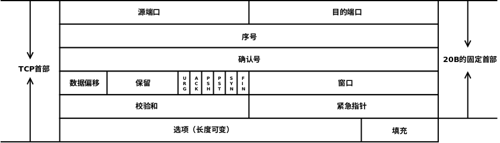

# 传输层  
---  
## 传输层提供的功能  
### 传输层的功能  
从通信和信息处理的角度看，传输层向它上面的应用层提供通信服务，它属于面向通信部分的最高层，同时也是用户功能中的最低层。  
传输层位于网络层之上，它为运行在不同主机上的进程之间提供了逻辑通信，而网络层提供主机之间的逻辑通信。显然，即使网络层协议不可靠，传输层同样能为应用程序提供可靠的服务。  
网络的边缘部分的两台主机使用网络核心部分的功能进行端到端的通信时，只有主机的协议栈才有传输层和应用层，而路由器在转发分组时都只用到下三层的功能（即在通信子网中没有传输层，传输层只存在于通信子网以外的主机中）。  
传输层的功能如下：  
+ 传输层提供应用程序之间的逻辑通信（即端到端的通信）。与网络层的区别是，网络层提供的是主机之间的逻辑通信。  
  从网络层来说，通信的双方是两台主机，IP数据报的首部给出了这两台主机的IP地址。但“两台主机之间的通信”实际上是两台主机中的应用程序之间的通信，应用程序之间的通信又称端到端的逻辑通信。这里“逻辑通信”的意思是：传输层之间的通信好像是沿水平方向传送数据，但事实上这两个传输层之间并没有一条水平方向的物理连接。  
+ 复用和分用。复用是指发送方不同的应用进程都可使用同一个传输层协议传送数据；分用是指接收方的传输层在剥去报文的首部后能够把这些数据正确交付到目的应用程序。  
+ 传输层还要对收到的报文进行差错检测（首部和数据部分）。而网络层只检查IP数据报的首部，不检验数据部分是否出错。  
+ 提供两种不同的传输协议，即面向连接的TCP和无连接的UDP。而网络层无法同时实现两种协议（即网络层要么只提供面向连接的服务，如虚电路；要么只提供无连接服务，如数据报，而不可能在网络层同时存在这两种方式）。  

传输层向高层用户屏蔽了低层网络核心的细节（如网络拓扑、路由协议等），它使应用进程看见的是好像在两个传输层实体之间有一条端到端的逻辑通信信道，这条逻辑通信信道对上层的表现却因传输层协议而又有很大的差别。当传输层采用面向连接的TCP时，尽管下面的网络是不可靠的，但这种逻辑通信信道就相当于一条全双工的可靠信道。但当传输层采用无连接的UDP时，这种逻辑通信信道仍然是一条不可靠信道。  

### 传输层的寻址与端口  
#### 端口的作用  
端口能够让应用层的各种应用程序将其数据通过端口向下交付给传输层，以及让传输层知道应将其报文段的数据向上通过端口交付给应用层相应的进程。端口是传输层服务访问点TSAP，它在传输层的作用类似于IP地址在网络层的作用或MAC地址在数据链路层的作用，只不过IP地址和MAC地址标识的是主机，而端口标识的是主机中的应用程序。  
数据链路层的SAP是MAC地址，网络层的SAP是IP地址，传输层的SAP是端口。  
在协议栈层间的抽象的协议端口是软件端口，它与路由器或交换机上的硬件端口是完全不同的概念。硬件端口是不同硬件设备进行交互的接口，而软件端口是应用层的各种协议进程与传输实体进行层间交互的一种地址。传输层使用的是软件端口。  

#### 端口号  
应用程序通过端口号进行标识，端口号的长度为16bit，能够表示65536个不同的端口号。**端口号只具有本地意义**，即端口号只标识本计算机应用层中的各进程，在因特网中不同计算机的相同端口号是没有联系的。根据端口号范围可将端口分为两类：  
+ 服务端使用的端口号。这里又分为两类，最重要的一类是熟知端口号，数值为0-1023，IANA（互联网地址指派机构）把这些端口号指派给了TCP/IP最重要的一些应用程序，让所有的用户都知道。另一类称为登记端口号，数值为1024-49151.它是供没有熟知端口号的应用程序使用的，使用这类端口必须在IANA登记，以防止重复。  
  一些常用的熟知端口号如下：  
  |应用程序|FTP|TELNET|SMTP|DNS|TFTP|HTTP|SNMP|  
  |:---:|:---:|:---:|:---:|:---:|:---:|:---:|:---:|  
  |熟知端口号|21|23|25|53|69|80|161|  

+ 客户端使用的端口号，数值为49152-65535.由于这类端口号仅在客户进程运行时才动态地选择，因此又称短暂端口号（也称临时端口）。通信结束后，刚用过的客户端口号就不复存在，从而这个端口号就可供其他客户进程使用。  

#### 套接字  
在网络中通过IP地址来标识和区别不同的主机，通过端口号来标识和区分一台主机中的不同应用进程。在网络中采用发送方和接收方的套接字(Socket)组合来识别端点。所谓套接字，实际上是一个通信端点，即  
套接字 = （主机IP地址，端口号）  
它唯一地标识网络中的一台主机和其上的一个应用（进程）。  
在网络通信中，主机A发给主机B的报文段包含目的端口号和源端口号，源端口号是“返回地址”的一部分，即当B需要发回一个报文段给A时，B到A的报文段中的目的端口号便是A到B的报文段中的源端口号。  

#### 无连接服务和面向连接服务  
面向连接服务就是在通信双方进行通信之前，必须先建立连接，在通信过程中，整个连接的情况一直被实时地监控和管理。通信结束后，应该释放这个连接。  
无连接服务是指两个实体之间的通信不需要先建立好连接，需要通信时，直接将信息发送到“网络”中，让该信息的传递在网上尽力而为地往目的地传送。  
TCP/IP协议簇在IP层之上提供了两个传输协议：一个是面向连接的传输控制协议TCP，采用TCP时，传输层向上提供的是一条全双工的可靠逻辑信道；另一个是无连接的用户数据报协议UDP，采用UDP时，传输层向上提供的是一条不可靠的逻辑信道。  
TCP提供面向连接的服务，在传送数据之前必须先建立连接，数据传送结束后要释放连接。TCP不提供广播或组播服务。由于TCP提供面向连接的可靠传输服务，因此不可避免地增加了许多开销，如确认、流量控制、计时器及连接管理等。这不仅使协议数据单元的头部增大很多，还要占用许多的处理机资源。因此TCP主要适用于可靠性更重要的场合，如文件传输协议FTP、超文本传输协议HTTP、远程登录TELNET等。  
UDP是一个无连接的非可靠传输层协议。它在IP之上仅提供两个附加服务：多路复用和对数据的错误检查。IP知道怎样把分组投递给一台主机，但不知道怎样把它们投递给主机上的具体应用。UDP在传送数据之前不需要先建立连接，远程主机的传输层收到UDP报文后，不需要给出任何确认。由于UDP比较简单，因此执行速度比较快、实时性好。使用UDP的应用主要包括小文件传送协议TFTP、DNS、SNMP和实时传输协议RTP。  
TCP和网络层虚电路的区别：TCP报文段在传输层抽象的逻辑信道中传输，对路由器不可见；虚电路所经过的交换结点都必须保存虚电路状态信息。在网络层若采用虚电路方式，则无法提供无连接服务；而传输层采用TCP不影响网络层提供无连接服务。  

---  
## UDP协议  
### UDP数据报  
#### UDP概述  
RFC768定义的UDP只是做了传输协议能够做的最少工作，它仅在IP数据报服务之上增加了 两个最基本的服务：复用和分用以及差错检测。如果应用程序开发者选择UDP而非TCP，那么应用程序几乎直接与IP打交道。  
UDP具有如下优点：  
+ UDP无须建立连接。因此UDP不会引入建立连接的时延。  
+ 无连接状态。TCP需要在端系统中维护连接状态。此连接状态包括接收和发送缓存、拥塞控制参数和序号与确认号的参数。而UDP不维护连接状态，也不跟踪这些参数。因此，某些专用应用服务器使用UDP时，一般都能支持更多的活动客户机。  
+ 分组首部开销小。TCP有20B的首部开销，而UDP仅有8B的开销。  
+ 应用层能更好地控制要发送的数据和发送时间。UDP没有拥塞控制，因此网络中的拥塞不会影响主机的发送效率。某些实时应用要求以稳定的速度发送，能容忍一些数据的丢失，但不允许有较大的时延，而UDP正好满足这些应用的需求。  

UDP常用于一次性传输较少数据的网络应用，如DNS、SNMP等，因为对于这些应用，若采用TCP，则将为连接创建、维护和拆除带来不小的开销。UDP也常用于多媒体应用（如IP电话、实时视频会议、流媒体等），显然，可靠数据传输对这些应用来说并不是最重要的，但TCP的拥塞控制会导致数据出现较大的延迟，这是它们不可容忍的。  
UDP提供尽最大努力的交付，即不保证可靠交付，但这并不意味着应用对数据的要求是不可靠的，因此所有维护传输可靠性的工作需要用户在应用层来完成。应用实体可以根据应用的需求来灵活设计自己的可靠性机制。  
UDP是面向报文的。发送方UDP对应用层交下来的报文，在添加首部后就向下交付给IP层，既不合并也不拆分，而是保留这些报文的边界；接收方UDP对IP层交上来的UDP数据报，在去除首部后就原封不动地交付给上层应用进程，一次交付一个完整的报文。因此报文不可分割，是UDP数据报处理的最小单位。  

#### UDP的首部格式  
UDP数据报包含两部分：UDP首部和用户数据，整个UDP数据报作为IP数据报的数据部分封装在IP数据报中。UDP首部有8B，由4个字段组成，每个字段的长度都是2B。各字段意义如下：  
+ 源端口。源端口号。在需要对方回信时选用，不需要可用全0。  
+ 目的端口。目的端口号，这在终点交付报文时必须使用到。  
+ 长度。UDP数据报的长度（包括首部和数据），其最小值是8B（仅含首部）。  
+ 校验和。检测UDP数据报在传输中是否有错。有错就丢弃。该字段是可选的，当源主机不想计算校验和时，则直接令该字段为全0。  

当传输层从IP层收到UDP数据报时，就根据首部中的目的端口，把UDP数据报通过相应的端口上交到应用程序。  
如果接收方UDP发现收到的报文中的目的端口号不正确（即不存在对应于端口号的应用进程），那么就丢弃该报文，并由ICMP发送“端口不可达”差错报文给发送方。  

### UDP校验  
在计算校验和时，要在UDP数据报之前增加12B的伪首部，伪首部并不是UDP的真正首部。只是在计算校验和时，临时添加在UDP数据报的前面，得到一个临时的UDP数据报。校验和就是按照这个临时的UDP数据报计算的。伪首部既不向下传送也不向上递交，而仅为了计算校验和。这样的校验和，既检查了UDP数据报，又对IP数据报的源IP地址和目的IP地址进行了检验。  
UDP校验和的计算方法和IP数据报首部校验和的计算方法相似，都使用二进制反码运算求和再取反。但不同的是，IP数据报的校验和指检验IP数据报的首部，但UDP的校验和则检查首部和数据部分。  
发送方首先把全0放入校验和字段并添加伪首部，然后把UDP数据报视为许多16位的子连接起来。若UDP数据报的数据部分不是偶数个字节，则要在数据部分末尾增加一个全零字节（但此字节不发送）。接下来按二进制反码计算出这些16位字的和，并将此和的二进制反码写入校验和字段。接收方把收到的UDP数据报加上伪首部（如果不为偶数个字节，那么还需要补上全零字节）后，按二进制反码计算出这些16位字的和。当无差错时其结果应全为1，否则表明有差错出现，接收方就应该丢弃这个UDP数据报。  
如果UDP校验和校验出UDP数据报是错误的，那么可以丢弃，也可以交付给上层，但是需要附上错误报告，即告诉上层这是错误的数据报。  
这种简单的差错检测方法的检错能力并不强，但它的好处是简单、处理速度快。  

---  
## TCP协议  
### TCP协议的特点  
TCP是在不可靠的IP层之上实现的可靠的数据传输协议，它主要解决传输的可靠、有序、无丢失和不重复问题。TCP是TCP/IP体系中非常复杂的一个协议，主要特点如下：  
+ TCP是面向连接的传输层协议。  
+ 每条TCP连接只能有两个端点，每条TCP连接只能是点对点的（一对一）。  
+ TCP提供可靠的交付服务，保证传送的数据无差错、不丢失、不重复且有序。  
+ TCP提供全双工通信，允许通信双方的应用进程在任何时候都能发送数据，为此TCP连接的两端都设有发送缓存和接收缓存，用来临时存放双向通信的数据。  
  发送缓存用来暂时存放以下数据：  
  - 发送应用程序传送给发送方TCP准备发送的数据  
  - TCP已发送但尚未收到确认的数据。  
  
  接收缓存用来暂时存放以下数据：  
  - 按序到达但尚未被接收应用程序读取的数据  
  - 不按序到达的数据  

+ TCP是面向字节流的，虽然应用程序和TCP的交互是一次一个数据块（大小不等），但TCP把应用程序交下来的数据仅视为一连串的无结构的字节流。  

### TCP报文段  
TCP传送的数据单元称为报文段。一个TCP报文段分为TCP首部和TCP数据两部分，整个TCP报文段作为IP数据报作为IP数据报的数据部分封装在IP数据报中。其首部的前20B是固定的。TCP报文段的首部最短为20B，后面有4N字节是根据需要而增加的选项，通常长度为4B的整数倍。  
TCP报文段既可以用来运载数据，又可以用来建立连接、释放连接和应答。  

各字段意义如下：  
+ 源端口和目的端口号。各占2B。端口是运输层与应用层的服务接口，运输层的复用和分用功能都要通过端口实现。  
+ 序号字段。占4B。TCP是面向字节流的（即TCP传送时逐个字节传送的），所以TCP连接传送的数据流中每个字节都编上一个序号。序号字段的值指的是本报文段所发送的数据的第一个字节的序号。  
+ 确认号字段。占4B，是期望收到对方的下一个报文段的数据的第一个字节的序号。若确认号为N，则表明到序号N-1为止的所有数据都已正确收到。  
+ 数据偏移（即首部长度）。占4位。指出TCP报文段的数据起始处距离TCP报文段的起始处有多远。  
  “数据偏移”的单位是32位。（即满足4B的倍数）。  

+ 保留字段。占6位，保留为今后使用，但目前应置为0，该字段可以忽略不计。  
+ 紧急位URG。URG=1时，表明紧急指针字段有效。它告诉系统报文段中有紧急数据，应尽快传送（相当于高优先级的数据）。但URG需要和紧急指针配套使用，即数据从第一个字节到紧急指针所指字节就是紧急数据。  
+ 确认位ACK。只有当ACK=1时确认号字段才有效。当ACK=0时，确认号无效。TCP规定，在连接建立后所有传送的报文段都必须把ACK置1。  
+ 推送位PSH。接收TCP收到PSH=1的报文段，就尽快地交付给接收应用程序，而不再等到整个缓存都填满后再向上交付。  
+ 复位位RST。RST=1时，表明TCP连接中出现严重差错（如主机崩溃或其他原因），必须释放连接，然后重新建立运输连接。  
+ 同步位SYN。同步SYN=1表示这是一个连接请求或连接接收报文。  
  当SYN=1，ACK=0是，表明这是一个连接请求报文，对方若同意建立连接，则在响应报文中使用SYN=1，ACK=1。  
+ 终止位FIN。用来释放一个连接。FIN=1表示此报文段的发送方的数据已发送完毕，并要求释放传输连接。  
+ 窗口字段。占2B。它指出现在允许对方发送的数据量，接收方的数据缓存空间是有限的，因此用窗口值作为接收方让发送方设置其发送窗口的依据，单位为字节。  
+ 校验和。占2B。校验和字段检验的范围包括首部和数据两部分。在计算校验和时，和UDP一样，要在TCP报文段的前面加上12B的伪首部（只需将UDP伪首部的第4个字段，即协议字段的17改为6，其他的和UDP一样）。  
+ 紧急指针字段。占16位，指出在本报文段中紧急数据共有多少字节（紧急数据放在本报文段数据的最前面，因此只需大小就能确定哪些为紧急数据）。  
+ 选项字段。长度可变。TCP最初之规定了一种选项，即最大报文长度(Maximum Segment Size,MSS)。MSS是TCP报文段中的数据字段的最大长度。  
+ 填充字段。这是为了使整个首部长度是4B的整数倍，因为数据偏移字段的单位为4B。  

### TCP连接管理  
TCP是面向连续的协议，因此每个TCP连接都有三个阶段：连接建立、数据传送和连接释放。TCP连接的管理就是使运输连接的建立和释放都能正常进行。  
在TCP连接建立的过程中，要解决以下三个问题：  
+ 要使每一方都能够确知对方的存在。  
+ 要允许双方协商一些参数（如最大窗口值、是否使用窗口扩大选项、时间戳选项及服务质量等）。  
+ 能够对运输实体资源（如缓存大小、连接表中的项目等）进行分配。  

TCP把连接作为最基本的抽象，每条TCP连接有两个端点，TCP连接的端点不是主机，不是主机的IP地址，不是应用进程，也不是传输层的协议端口。TCP连接的端口称为套接字socket或插口。端口拼接到IP地址即构成套接字。  
每条TCP连接唯一地被通信两端的两个端点（即两个套接字）确定。  
TCP连接的建立采用客户机/服务器方式。主动发起连接建立的应用程序称为客户机Client，而被动等待连接建立的应用程序称为服务器Server。  

#### TCP连接的建立  
连接的建立经历以下3个步骤，通常称为三次握手。  
第一步：客户机的TCP首先向服务器TCP发送一个连接请求报文段。这个特殊的报文段中不含应用层数据，其首部中的SYN标志位被置为1。另外，客户端会随机选择一个起始序号`seq = 𝑥`（连接请求报文不携带数据，但要消耗一个序号）。  
第二步：服务器的TCP收到连接请求报文段后，如同意建立连接，就向客户端发回确认，并为该TCP连接分配TCP缓存和变量。在确认报文中，SYN和ACK位都被置为1，确认号字段的值为𝑥+1，并且服务器随机产生起始序号`seq = 𝑦`（确认报文不携带数据，但也要消耗一个序号）。确认报文同样不包含应用层数据。  
第三步：当客户机收到确认报文段后，还要向服务器给出确认，并且也要给该连接分配缓存和变量。这个报文段的ACK标志被置为1，序号字段为 𝑥 + 1，确认号字段为`ack = y + 1`。该报文段可以携带数据，若不携带数据则不消耗序号。  
成功进行以上三步后，就建立了TCP连接，接下来就可以传送应用层数据。TCP提供的是全双工通信，因此通信双方的应用进程在任何时候都能发送数据。  
另外，服务器的资源是在完成第二次握手时分配的，而客户端的资源是在完成第三次握手时分配的，这就使得服务器易于受到SYN洪泛攻击。  

#### TCP连接的释放  
参与TCP连接的两个进程中的任何一个都能终止该连接。TCP连接释放的过程通常称为四次握手。  
第一步：客户端打算关闭连接时，向其TCP发送一个连接释放报文段，并停止发送数据，主动关闭TCP连接，该报文段的FIN标志位被置为1，`squ = 𝑢`，它等于前面已传送过的数据的最后一个字节的序号加1（FIN报文段即使不携带数据，也要消耗一个序号）。TCP是全双工的，即可以想象为一条TCP连接上有两条数据通路。发送FIN报文时，发送FIN的一端不能再发送数据，即关闭了其中一条数据通路，但对方还可以发送数据。  
第二步：服务器收到连接释放报文段后即发出确认，确认号是`ack = 𝑢 + 1`，而这个报文段自己的序号是`𝑣`，等于它前面已传送过的数据的最后一个字节的序号加1。此时，从客户机到服务器这个方向的连接就释放了，TCP连接处于半关闭状态。但服务器若发送数据，客户机仍要接收，即从服务器到客户机这个方向的连接并未关闭。  
第三步：若服务器已经没有要向客户机发送的数据，就通知TCP释放连接，此时其发出FIN=1的连接释放报文段。  
第四步：客户机收到连接释放报文段后，必须发出确认。在确认报文段中，ACK字段被置为1，确认号`ack = 𝑤 + 1`，序号`seq = 𝑢 + 1`。此时TCP连接还未释放，必须经过时间等待计时器设置的时间2MSL后，才能进入连接关闭状态。  

对上述TCP连接建立和释放的总结如下：  
+ 连接建立  
  - SYN = 1，seq = 𝑥  
  - SYN = 1，ACK = 1，seq = 𝑦，ack = 𝑥 + 1  
  - ACK = 1，seq = 𝑥 + 1，ack = 𝑦 + 1  

+ 释放连接  
  - FIN = 1，seq = 𝑢  
  - ACK = 1，seq = 𝑣，ack = 𝑢 + 1  
  - FIN = 1，ACK = 1，seq = 𝑤，ack = 𝑢 + 1  
  - ACK = 1，seq = 𝑢 + 1，ack = 𝑤 + 1  

### TCP可靠传输  
TCP的任务是在IP层不可靠的、尽力而为服务的基础上建立的一种可靠数据传输服务。TCP提供的可靠数据传输服务保证接收方进程从缓存区读出的字节流与发送方发出的字节流完全一样。TCP使用了校验、序号、确认和重传机制来达到这一目的。其中，TCP的校验机制与UDP校验一样。  

#### 序号  
TCP首部的序号字段用来保证数据能有序提交给应用层，TCP把数据视为一个无结构但有序的字节流，序号建立在传送的字节流之上。而不建立在报文段之上。  
TCP连接传送的数据流中的每个字节都编上一个序号。序号字段的值是指本报文段所发送的数据的第一个字节的序号。  

#### 确认  
TCP首部的确认号是期望收到对方的下一个报文段的数据的第一个字节的序号。发送方缓冲区会存储那些已发送但未收到确认的报文段，以便在需要时重传。  
TCP默认使用累积确认，即TCP只确认数据流中至第一个丢失字节为止的字节。  

#### 重传  
有两种事件会导致TCP对报文段进行重传：超时和冗余ACK。  
+ 超时  
  TCP每发送一个报文段，就对这个报文段设置一次计时器。计时器设置的重传事件到期但还未收到确认时，就要重传这一报文段。  
  由于TCP的下层是一个互联网环境，IP数据报所选择的路由变化很大，因此传输层的往返时延的方差也很大。为了计算超时计时器的重传时间，TCP采用一种自适应算法，它记录一个报文段发出的时间，以及收到相应确认的时间，这两个时间之差称为报文段的往返时间(Round-Trip Time,RTT)。TCP保留了RTT的一个加权平均往返时间RTTs，它会随着测量RTT样本值的变化而变化。显然，超时计时器设置的超时重传时间(Retransmission Time-Out,RTO)应略大于RTTs，但也不能大太多，否则当报文段丢失时，TCP不能很快重传，导致数据传输时延大。  
+ 冗余ACK（冗余确认）  
  超时触发重传存在的一个问题是超时周期往往太长。所幸的是，发送方通常可在超时事件发生之前通过注意所谓的冗余ACK来较好地检测丢包情况。冗余ACK就是再次确认某个报文段的ACK，而发送方先前已经收到过该报文段的确认。TCP规定每当比期望大的失序报文段到达时，就发送一个冗余ACK，指明下一个期待字节的序号。发送方在收到冗余ACK时，可以认为其后的报文段丢失，此时发送方可以立即进行重发，这种技术通常称为快速重传。  

### TCP流量控制  
TCP提供流量控制服务来消除发送方使接收方缓冲区溢出的可能性，因此可以说流量控制是一个速度匹配服务（匹配发送方的发送速率与接收方的读取速率）。  
TCP提供一种基于滑动窗口协议的流量控制机制。在通信过程中，接收方根据自己接收缓冲的大小，动态地调整发送方的发送窗口大小，这称为接收窗口rwnd，即调整TCP报文段首部中的“窗口”字段值，来限制发送方向网络注入报文的速率。同时，发送方根据其对当前网络拥塞程序的估计而确定的窗口值，这称为拥塞窗口cwnd，其大小和网络的带宽和时延密切相关。  
例如，在通信中，有效数据只从A发往B，而B仅向A发送确认报文，这时B可以通过设置确认报文段首部的窗口字段来将rwnd通知给A。rwnd即接收方允许连接接收的最大能力，单位是字节。发送方A总是根据最新收到的rwnd值来限制自己发送窗口的大小，从而将未确认的数据量控制在rwnd大小之内，保证A不会使B的接收缓冲区溢出。当然，A的发送窗口的实际大小取rwnd和cwnd中的最小值。  
传输层和数据链路层的流量控制的区别是：传输层定义端到端用户之间的流量控制，数据链路层定义两个中间的相邻结点的流量控制。另外，数据链路层的滑动窗口协议的窗口大小不能动态变化，传输层的则可以动态变化。  

### TCP拥塞控制  
所谓拥塞控制，是指防止过多的数据注入网络，保证网络中的路由器或链路不致过载。出现拥塞时，端点并不了解到拥塞发生的细节，对通信连接的端点来说，拥塞往往表现为通信时延的增加。当然，拥塞控制和流量控制也有相似的地方，即它们都通过控制发送方发送数据的速率来达到控制效果。  
拥塞控制与流量控制的区别：拥塞控制是让网络能够承受现有的网络负荷，是一个全局性的过程，涉及所有的主机、所有的路由器，以及与降低网络传输性能有关的所有因素。相反，流量控制往往是指点对点的通信量的控制，即接收端控制发送端，它所要做的 是抑制发送端发送数据的速率，以便接收端来得及接收。  
为了更好地对传输层进行拥塞控制，因特网建议标准定义了以下4种算法：慢开始、拥塞避免、快重传、快恢复。  
发送方在确认发送报文段速率时，既要根据接收方的接受能力，又要从全局考虑不要使网络发生拥塞。因此，TCP协议要求发送方维护以下两个窗口：  
+ 接收窗口rwnd，接收方根据目前接收缓存大小所许诺的最新窗口值，反映接收方的容量。由接收方根据其放在TCP报文的首部的窗口字段通知发送方。  
+ 拥塞窗口cwnd，发送方根据自己估算的网络拥塞程度而设置的窗口值，反映网络的当前容量。只要网络未出现拥塞，拥塞窗口就再增大一些，以便把更多的分组发送出去。但只要网络出现拥塞，拥塞窗口就减小一些，以减少注入网络的分组数。  

发送窗口的上限应取接收窗口rwnd和拥塞窗口cwnd中较小的一个，即  
发送窗口的上限值 = min[rwnd, cwnd]  
接收窗口的大小可根据TCP报文首部的窗口字段通知发送方，发送方则根据以下算法维护拥塞窗口的大小：  
#### 慢开始和拥塞避免  
+ 慢开始算法  
  在TCP刚刚连接好并开始发送TCP报文段时，先令拥塞窗口cwnd = 1，即一个最大报文段长度MSS。每收到一个对新报文段的确认后，将cwnd加1，即增大一个MSS。用这样的方法逐步增大发送方的拥塞窗口cwnd，可使分组注入网络的速率更加合理。  
  例如，A向B发送数据，发送时A的拥塞窗口为2，那么A一次可以发送两个TCP报文段。经过一个RTT后（也称一个传输轮次），A收到B对刚才两个报文的确认，于是把拥塞窗口调整为4，下一次发送时就可一次发送4个报文段。  
  使用慢开始算法后，每经过一个传输轮次（即往返时延RTT），拥塞窗口cwnd就会加倍，即cwnd的大小指数式增长。这样，慢开始一直把拥塞窗口cwnd增大到一个规定的慢开始门限ssthresh（阈值），然后改用拥塞避免算法。  

+ 拥塞避免算法  
  拥塞避免算法的做法如下：发送端的拥塞窗口cwnd每经过一个往返时延RTT就增加一个MSS的大小，而不是加倍，使cwnd按线性规律缓慢增长（即加法增大），而当出现一次超时（网络拥塞）时，令慢开始门限ssthresh等于当前cwnd的一半（即乘数减小）。  
  根据cwnd的大小执行不同的算法，可归纳如下：  
  - 当cwnd < ssthresh时，使用慢开始算法。  
  - 当cwnd > ssthresh时，停止使用慢开始算法而改用拥塞避免算法。  
  - 当cwnd = ssthresh时，即可使用慢开始算法，又可使用拥塞避免算法（通常做法）。  

+ 网络拥塞的处理  
  网络出现拥塞时，无论是在慢开始阶段还是在拥塞避免阶段，只要发送方检测到超时时间的发生（未按时收到确认，重传计时器超时），就要把慢开始门限ssthresh设置为出现拥塞时的发送方的cwnd值的一半（但不能小于2）。然后把拥塞窗口cwnd重新设置为1，执行慢开始算法。这样做的目的是迅速减少主机发送到网络中的分组数，使得发生拥塞的路由器有足够时间把队列中挤压的分组处理完。  
  拥塞避免并不能完全地避免拥塞。利用以上措施要完全避免网络拥塞是不可能。拥塞避免是指在拥塞避免阶段把拥塞窗口控制为按线性规律增长，使网络不容易出现拥塞。  
  注意在慢开始（即指数增长）阶段，若2cwnd > ssthresh，则下一个RTT的cwnd等于ssthresh，而不等于2cwnd，即**cwnd不能越过ssthresh值**。  
  在慢开始和拥塞避免算法中使用了“乘法减小”和“加法增大”方法。“乘法减小”是指不论是在慢开始阶段还是在拥塞避免阶段，只要出现一次超时（即很可能出现了网络拥塞），就把慢开始门限值ssthresh设置为当前拥塞窗口值的一半。网络频繁出现拥塞时，ssthresh值就下降得很快，以大大减少注入网络的分组数。而“加法增大”是指执行拥塞避免算法后，在收到对所有报文段的确认后（即经过一个RTT），就把拥塞窗口cwnd增加一个MSS大小，使拥塞窗口缓慢增大，以防止网络过早出现拥塞。  

#### 快重传和快恢复  
快重传和快恢复算法是对慢开始和拥塞避免算法的改进。  
+ 快重传  
  快重传技术使用了冗余ACK技术来检测丢包的发生。同样，冗余ACK也用于网络拥塞的检测。快重传并非取消重传计时器，而是在某些情况下可更早地重传丢失的报文段。  
  当发送方连续收到3个重复的ACK报文段时，直接重传对方尚未收到的报文段，而不必等待那个报文段设置的重传计时器超时。  
+ 快恢复  
  快恢复算法的原理如下：发送端收到连续三个冗余ACK（即重复确认）时，执行“乘法减小”算法，把慢开始门限ssthresh设置为出现拥塞时发送方cwnd的一般。与慢开始（慢开始算法将拥塞窗口cwnd设置为1）的不同之处是，它把cwnd的值设置为慢开始门限ssthresh改变后的数值，然后开始执行拥塞避免算法（“加法增大”），使拥塞窗口缓慢地线性增大。  
  由于跳过了cwnd从1开始的慢开始过程，所以被称为快恢复。  

在流量控制中，发送方发送数据的量由接收方决定，而在拥塞控制中，则由发送方自己通过监测网络状况来决定。实际上，慢开始、拥塞避免、快重传和快恢复几种算法应是同时应用在拥塞控制机制之中的，当发送方检测到超时的时候，就采用慢开始和拥塞避免，当发送方接收到冗余ACK时，就采用快重传和快恢复。  