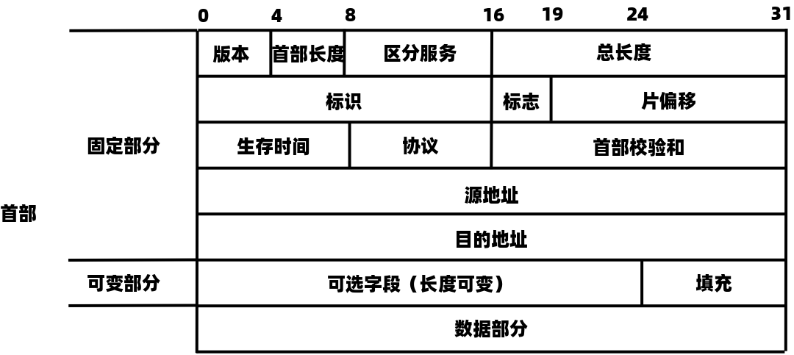
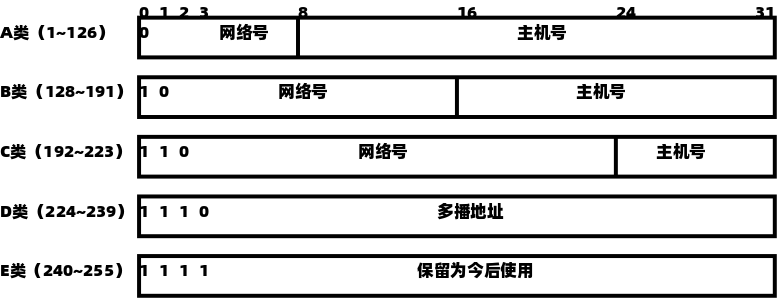

# 网络层  
---  
## 网络层的功能  
### 异构网络互联  
要在全球范围内把数以百万计的网络互联起来，并且能够互相通信，是一项非常复杂的任务，此时需要解决许多问题，比如不同的寻址方案、不同的网络接入机制、不同的差错处理方法、不同的路由选择机制等。用户的需求是多样的，没有一种单一的网络能适应所有用户的需求。网络层所要完成的任务之一就是使这些异构的网络实现互联。  
所谓网络互联，是指将两个以上的计算机网络，通过一定的方法，用一种或多种通信处理设备（即中间设备）相互连接起来，以构成更大的网络系统。中间设备又称中间系统或中继系统。  
根据所在的层次，中继系统分为以下4种：  
+ 物理层中继系统：中继器，集线器Hub  
+ 数据链路层中继系统：网桥或交换机  
+ 网络层中继系统：路由器  
+ 网络层以上的中继系统：网关  

使用物理层或数据链路层的中继系统时，只是把一个网络扩大了，而从网络层的角度看，它仍然是同一个网络，一般并不称之为网络互联。因此网络互联通常是指用路由去进行网络互联和路由选择。路由器是一台专用计算机，用于在互联网中进行路由选择。  
TCP/IP体系在网络互联上采用的做法是在网络层(IP层)采用标准化协议，但相互连接的网络可以是异构的。  
虚拟互联网络也就是逻辑互联网络，即互联起来的各种物理网络的异构性本来是客观存在的，但是通过使用IP就可以使这些性能各异的网络在网络层上看起来好像是一个统一的网络。这种使用IP的虚拟互联网络可简称为IP网络。  
使用虚拟互联网络的好处是：当互联网上的主机进行通信时，就好像在一个网络上通信一样，而看不见互联的具体的网络异构细节（如具体的编址方案、路由选择协议）。  

### 路由与转发  
路由器主要完成两个功能：一是路由选择（确定哪一条路径），二是分组转发（当一个分组到达时所采取的动作）。前者是根据特定的路由选择协议构造出路由表，同时经常或定期地和相邻路由器交换里有信息而不断地更新和维护路由表。后者处理通过路由器的数据流，关键操作是转发表查询、转发及相关的队列管理和任务调度等。  
+ 路由选择。指按照复杂的分布式算法，根据从各相邻路由器所得到的关于整个网络拓扑的变化情况，动态地改变所选择的路由。  
+ 分组转发。指路由器根据转发表将用户的IP数据报从合适的端口发送出去。  

路由表是根据路由选择算法得出的，而转发表是从路由表得出的。转发表的结构应当使查找过程最优化，路由表则需要对网络拓扑变化的计算最优化。  

### 拥塞控制  
在通信子网中，因出现过量的分组而引起网络性能下降的现象称为拥塞。例如，某个路由器所在的链路的带宽为R B/s，如果IP分组只从它的某个端口进入，那么其速率为rin B/s。当rin = R时，可能看起来是件“好事”，因为链路带宽被充分利用。但是，当分组到达路由器的速率接近R时，平均时延急剧增加，并且会有大量的分组被丢弃（路由器端口的缓冲区是有限的），整个网络的吞吐量会骤降，源与目的地之间的平均时延也会变得近乎无穷大。  
判断网络是否进入拥塞状态的方法是，观察网络的吞吐量与网络负载的关系：如果随着网络负载的增加，网络的吞吐量明显小于正常的吞吐量，那么网络就可能已进入“轻度拥塞”状态；如果网络的吞吐量随着网络负载的增大而下降，那么网络就可能已进入拥塞状态；如果网络的负载继续增大，而网络的吞吐量下降到零，那么网络就可能已进入死锁状态。  
为避免拥塞现象的出现，要采用能防止拥塞的一系列方法对子网进行拥塞控制。拥塞控制主要解决的问题是如何获取网络中发生拥塞的信息，从而利用这些信息进行控制，以避免由于拥塞而出现分组的丢失，以及严重拥塞而产生网络死锁的现象。  
拥塞控制的作用是确保子网能够承载所达到的流量，这是一个全局性的过程，设计各方面的行为：主机、路由器及路由器内部的转发处理过程等。单一地增加资源并不能解决拥塞。  
流量控制和拥塞控制的区别：流量控制往往是指在发送端和接收端之间的点对点通信量的控制。流量控制所要做的是抑制发送端发送数据的速率，以便接收端来得及接收。而拥塞控制必须保证通信子网能够传送待传送的数据，是一个全局性的问题，涉及网络中所有的主机、路由器及导致网络传输能力下降的所有因素。  
拥塞控制的方法有两种： 
+ 开环控制。在设计网络时事先将有关发生拥塞的因素考虑周到，力求网络在工作时不产生拥塞。这是一种静态的预防方法。一旦整个系统启动并运行，中途就不再需要修改。开环控制手段包括确定何时可接收新流量、何时可丢弃分组即丢弃哪些分组，确定何种调度决策等。所有这些手段的共性是，在决定时不考虑当前网络的状态。  
+ 闭环控制。事先不考虑有关发生拥塞的各种因素，采用监测网络系统去监视，及时检测哪里发生了拥塞，然后将拥塞信息传到合适的地方，以便调整网络系统的运行，并解决出现的问题。闭环控制是基于反馈环路的概念，是一种动态的方法。  

---  
## 路由算法  
### 静态路由与动态路由  
路由器转发分组是通过路由表转发的，而路由表是通过各种算法得到的。从能否随网络的通信量或拓扑自适应地进行调整变化来划分，路由算法可分为如下两大类。  
静态路由算法（又称非自适应路由算法）。指由网络管理员手工配置的路由信息。当网络的拓扑结构或链路的状态发生变化时，网络管理员需要手动去修改路由表中相关的静态路由信息。大型和复杂的网络环境通常不宜采用静态路由。一方面，网络管理员难以全面了解整个网络的拓扑结构；另一方面，当网络的拓扑结构和链路状态发生变化时，路由表中的静态路由信息需要大范围地调整，这一工作的难度和复杂度非常高。  
动态路由算法（又称自适应路由算法）。指路由器上的路由表项是通过互相连接的路由器之间彼此交换信息，然后根据一定的算法优化出来的，而这些路由信息会在一定时间间隙里不断更新，以适应不断变化的网络，随时获得最优的寻路效果。  
静态路由算法的优点是简便、可靠，在负荷稳定、拓扑变化不大的网络中运行效果很好，因此仍广泛用于高度安全的军事系统和较小的商业网络。动态路由算法能改善网络的性能并有助于流量管理；但算法复杂，会增加网络的负担，有时因动态变化的反应太快而引起振荡，或反应太慢而影响网络路由的一致性，因此要仔细设计动态路由算法，以发挥其优势。常用的动态路由算法可分为两类：距离-向量路由算法和链路状态路由算法。  

### 距离-向量路由算法  
在距离-向量路由算法中，所有结点都定期地将它们的整个路由选择表传送给所有与之直接相邻的结点。这种路由选择表包含：  
+ 每条路径的目的地  
+ 路径的代价  

在这种算法中，所有结点都必须参与距离向量交换，有保证路由的有效性和一致性，也就是说，所有的结点都监听来自其他结点传来的路由选择更新信息，并在下列情况下更新它们的路由选择表：  
+ 被通告一条新的路由，该路由在本结点的路由表中不存在，此时本地系统加入这条新的路由。  
+ 发来的路由信息中有一条到达某个目的地的路由，该路由与当前使用的路由相比，有较短的距离。此种情况下，就用经过发送路由信息的结点的新路由替换路由表中到达那个目的地的现有路由。  

距离-向量路由算法的实质是，迭代计算一条路由中的站段数或延迟时间，从而得到到达一个目标的最短通路。它要求每个结点在每次更新时都将它的全部路由表发送给所有相邻的结点。显然，更新报文的大小与通信子网的结点个数成正比，大的通信子网将导致很大的更新报文。由于更新报文发给直接相邻的结点，所以所有结点都将参加路由选择信息交换。基于这些原因，在通信子网上传送的路由选择信息的数量很容易变得非常大。  
最常见的距离-向量路由算法是RIP算法，它采用“跳数”作为距离的度量。  

### 链路状态路由算法  
链路状态路由算法要求每个参与该算法的结点都具有完全的网络拓扑信息，它们执行下述两项任务。第一，主动测试所有邻接结点的状态。两个共享一条链路的结点是相邻结点，它们连接到同一条链路，或者连接到同一广播型物理网络。第二，定期地将链路状态传播给所有其他结点（或称路由结点）。典型的链路状态算法是OSPF算法。  
在一个链路状态路由选择中，一个结点检查所有直接链路的状态，并将所得的状态信息发送给网上的所有其他结点，而不是仅送给那些直接相连的结点。每个结点都用这种方式从网上所有其他的结点接收包含直接链路状态的路由选择信息。  
每当链路状态报文到达时，路由结点便使用这些状态信息去更新自己的网络拓扑和状态“视野图”，一旦链路状态发生变化，结点就对更新的网络图利用Dijkstra最短路径算法重新计算路由，从单一的源出发计算到达所有目的结点的最短路径。  
链路状态路由算法主要有三个特征：  
+ 向本自治系统中所有路由器发送信息，这里使用的方法是泛洪法，即路由器通过所有端口向所有相邻的路由器发送信息。而每个相邻路由器又将此信息发往其所有相邻路由器（但不再发送给刚刚发来信息的那个路由器）。  
+ 发送的信息是与路由器相邻的所有路由器的链路状态，但这只是路由器所知道的部分信息。所谓“链路状态”，是指说明本路由器与哪些路由器相邻及该链路的“度量”。对于OSPF算法，链路状态的“度量”主要用来表示费用、距离、时延带宽等。  
+ 只有当链路状态发生变化时，路由器才向所有路由器发送此消息。 

由于一个路由器的链路状态只涉及相邻路由器的连通状态，而与整个互联网的规模并无直接关系，因此链路状态路由算法可以用于大型的或路由变化聚敛的互联网环境。  
链路状态路由算法的主要优点是，每个路由结点都使用同样的原始状态数据独立地计算路径，而不依赖中间结点的计算；链路状态报文不加改变地传播，因此采用该算法易于查找故障。当一个结点从所有其他结点接收到报文时，它可以在本地立即计算正确的通路，保证一步汇聚。最后，由于链路状态报文仅运载来自单个结点关于直接链路的消息，其大小与网络中的路由结点数目无关，因此链路状态算法比距离-向量算法有更好的规模可伸展性。  
距离-向量路由算法与链路状态路由算法的比较：在距离-向量算法中，每个结点仅与它的直接邻居交谈，它为它的邻居提供从自己到网络中其他所有结点的最低费用估计。在链路状态路由算法中，每个结点通过广播的方式与其他所有结点交谈，但它仅告诉它们与它直接相连的链路的费用。相较之下，距离-向量路由算法有可能遇到路由环路等问题。  

### 层次路由  
当网络规模扩大时，路由器的路由表成比例地增大。这不仅会消耗越来越多的路由器缓冲区空间，而且需要用更多CPU时间来扫描路由表，用过多的带宽来交换路由状态信息。因此路由选择必须按照层次的方式进行。  
因特网将整个互联网划分为许多较小的自治系统，每个自治系统有权自主地决定本系统内应采用何种路由选择协议。如果两个自治系统需要通信，那么就需要一种在两个自治系统之间的协议来屏蔽这些差异。据此，因特网把路由选择协议划分为两大类：  
+ 一个自治系统内部所使用的路由选择协议称为内部网关协议IGP，也称域内路由选择，具体的协议有RIP和OSPF等。  
+ 自治系统之间所使用的路由选择协议称为外部网关协议EGP，也称域间路由选择，用在不同自治系统的路由器之间交换路由信息，并负责为分组在不同自治系统之间选择最优的路径。具体的协议有BGP。  

使用层次路由时，OSPF将一个自治系统再划分为若干区域，每个路由器都知道在本区域内如何把分组路由到目的地的细节，但不用知道其他区域的内部结构。  
采用分层次划分区域的方法虽然会使得交换信息的种类增多，但也会使OSPF协议更加复杂。但这样做却能使每个区域内部交换路由信息的通信量大大减小，因而使OSPF协议能够用于规模很大的自治系统中。  

---  
## IPv4  
### IPv4分组  
IPv4即现在普遍使用的IP（版本4）。IP定义数据传送的基本单元——IP分组及其确切的数据格式。IP也包括一套规则，指明分组如何处理、错误怎样控制。特别是IP还包含非可靠投递的思想，以及与此关联的分组路由选择的思想。  

#### IPv4分组的格式  
  

一个IP分组由首部和数据两部分组成。首部前一部分的长度是固定的，共20B，是所有IP分组必须具有的。在首部固定部分的后面是一些可选字段，其长度可变，用来提示错误检测及安全等机制。  
IP首部的部分重要字段含义如下：  
+ 版本。指IP的版本，目前广泛使用的版本号为4。  
+ 首部长度。占4位。**以32位为单位**，最大值为60B(15×4B)。最常用的首部长度是20B，此时不使用任何选项（即可选字段）。  
+ 总长度。占16位。指首部和数据之和的长度，**单位为字节**，因此数据报的最大长度为216-1B = 65535B。以太网帧的最大传送单元MTU为1500B，因此当一个IP数据报封装成帧时，数据报的总长度（首部加数据）一定不能超过下面数据链路层的MTU值。  
+ 标识。占16位。它是一个计数器，每产生一个数据报就加1，并赋值给标识字段。但它不是“序号”（**IP是无连接服务**）。当一个数据报的长度超过网络的MTU时，必须分片，此时每个数据报片都复制一次标识号，以便能正确重装成原来的数据报。  
+ 标志。占3位。标志字段的最低位为MF，`MF = 1`表示后面还有分片，`MF = 0`表示最后一个分片。标志字段中间的一位是DF，只有`DF = 0`时才允许分片。  
+ 片偏移。占13位。它指出较长的分组在分片后，某片在原分组中的相对位置。片偏移**以8个字节为偏移单位**，即每一个分片的长度一定是8B的整数倍。  
+ 首部校验和。占16位。IP数据报的首部校验和**只校验分组的首部**，而不校验数据部分。  
+ 生存时间TTL。占8位。数据报在网络中可通过的路由器数的最大值，标识分组在网络中的寿命，以确保分组不会永远在网络中循环。路由器在转发分组前，先把TTL减1。若TTL被减为0，则该分组必须丢弃。  
+ 协议。占8位。指出分组携带的数据使用何种协议，即分组的数据部分应交给哪个传输层协议，如TCP、UDP等。其中值为6表示TCP，值为17表示UDP。  
+ 源地址字段。占4B，标识发送方的IP地址。  
+ 目的地址字段。占4B，标识接收方的IP地址。  

#### IP数据报分片  
一个链路层数据报能承载的最大数据量称为最大传送单元MTU。因为IP数据报被封装在链路层数据报中，因此链路层的MTU严格地限制着IP数据报的长度，而且在IP数据报的源与目的地路径上的各段链路可能使用不同的链路层协议，有不同的MTU。例如，以太网的MTU为1500B，而许多局域网的MTU不超过576B。当数据报的总长度大于链路MTU时，就需要将IP数据报中数据分装在两个或多个较小的IP数据报中，这些较小的数据报称为片。  
片在目的地的网络层被重新组装。目的主机使用IP首部中的标识、标志和片偏移来完成对片的重组。创建一个IP数据报时，源主机为该数据报加上一个标识号。当一个路由器需要将一个数据包分片时，形成的每个数据报（即片）都具有原始数据报的标识号。当目的主机收到来自同一发送主机的一批数据报时，它可以通过检查数据报的标识号来确定哪些数据报属于同一个原始数据报的片。IP首部中的标志位有3比特，但只有后2比特有意义，分别是MF(More Fragment)和DF(Don't Fragment)。只有当DF = 0时，该数据报才可以被分片。MF则用来告知目的主机该IP数据报是否为原始数据报的最后一个片。当MF = 1时，表示相应的原始数据报还有后续的片；当MF = 0时，表示该数据报是相应原始数据报的最后一个片。目的主机在对片进行重组时，使用片偏移字段来确定片应放在原始IP数据报的哪个位置。  
IP分片涉及一定的计算。计算时需要注意的是片偏移的单位是8B。  

#### 网络层转发分组的流程  
网络层路由器执行的分组转发算法如下：  
+ 从数据报的首部提取目的地址的IP地址D，得出目的网络地址N。  
+ 若网络N与此路由器直接相连，则把数据报直接交付给目的主机D，这称为路由器的直接交付；否则是间接交付，执行下一步骤。  
+ 若路由表中有目的地址为D的特定主机路由（对特定的目的地址指明一个特定的路由，通常是为了控制或测试网络，或处于安全考虑才采用的），则把数据报传送给路由表中所指明的下一跳路由器；否则执行下一步。 
+ 若路由表中有到达网络N的路由，则把数据报传送给路由表指明的下一跳路由器；否则，执行下一步。  
+ 若路由表中有一个默认路由，则把数据报传送给路由表中所指明的默认路由器；否则，执行下一步。  
+ 报告转发分组出错。  

**得到下一跳路由器的IP地址后并不是直接把该地址填入待发送的数据报，而是将该IP地址转换成MAC地址（通过ARP），将其放到MAC帧首部中，然后根据这个MAC地址找到下一跳路由器。在不同网络中传送时，MAC帧的源地址和目的地址要发生变化，但是网桥在转发帧时，不改变帧的源地址。**  

### IPv4地址和NAT  
#### IPv4地址  
连接到因特网上的每台主机（或路由器）都分配一个32比特的全球唯一标识符，即IP地址。**传统的IP地址是分类的地址**，分为A、B、C、D、E五类。  
无论哪类IP地址，都由网络号和主机号两部分组成。即IP地址::={<网络号>，<主机号>}。其中网络号标识主机（或路由器）所连接到的网络。一个网络号在整个因特网范围内必须是唯一的。主机号标识该主机（或路由器）。一个主机号在它前面的网络号所指明的网络范围内必须是唯一的。由此可见，一个IP地址在整个因特网范围内是唯一的。  

  

在各类IP地址中，有些IP地址具有特殊用途，不得做主机的IP地址：  
+ 主机号全为0表示网络本身。  
+ 主机号全为1表示本网络的广播地址，又称直接广播地址。  
+ 127.0.0.1保留为环路自检(Loopback Test)地址，此地址表示任意主机本身，目的地址为环回地址IP数据报永远不会出现在任何网络上。  
+ 32位全为0，即0.0.0.0表示本网络上的本主机。  
+ 32位全为1，即255.255.255.255表示整个TCP/IP网络的广播地址，又称受限广播地址。实际使用时，由于路由器对广播域的隔离，255.255.255.255等效为本网络的广播地址。  

常见的三类IP地址的使用范围如下：  
|网络类别|最大可用网络数|第一个可用的网络号|最后一个可用的网络号|每个网络中的最大主机数|  
|:---:|:---:|:---:|:---:|:---:|  
|A|27-2|1|126|224-2|  
|B|214-1|128.1|191.255|216-2|  
|C|221-1|192.0.1|223.255.255|28-2|  

表中，A类地址的网络书减2的原因是：第一，网络号字段全为0的IP地址是保留地址，意思是“本网络”；第二，网络号为127的IP地址是环回测试地址。B类地址的可用网络数减1的原因是128.0这个网络号是不可指派的。C类地址的可用网络数减一的原因是网络号为192.0.0的网络是不可指派的。  
IP地址有以下重要特点：  
+ 每个IP地址都由网络号和主机号两部分组成，因此IP地址是一种分等级的地址结构。分等级的好处是：  
  - IP地址管理机构在分配IP地址时只分配网络号（第一级），而主机号（第二级）则由得到该网络的单位自行分配，方便了IP地址的管理。  
  - 路由器仅根据目的主机所连接的网络号来转发分组，从而减小了路由表所占的存储空间。  

+ IP地址是标志一台主机（或路由器）和一条链路的接口。当一台主机同时连接到两个网络时，该主机就必须同时具有两个相应的IP地址，每个IP地址的网络号必须与所在网络的网络号相同，且这两个IP地址的网络号是不同的。因此IP网络上的一个路由器必然至少具有两个IP地址（路由器每个端口至少分配一个IP地址）。  
+ 用转发器或桥接器（网桥等）连接的若干LAN仍然是同一个网络（同一个广播域），因此该LAN中所有主机的IP地址的网络号必须相同，但主机号必须不同。  
+ 在IP地址中，所有分配到网络号的网络（无论是LAN还是WAN）都是平等的。  
+ 在同一个局域网上的主机或路由器的IP地址的网络号必须是一样的。路由器总是具有两个或两个以上的IP地址，路由器的每个端口都有一个不同网络号的IP地址。  

#### 网络地址转换  
网络地址转换NAT是指通过将专用网络地址转换为公用地址，从而对外隐藏内部管理的IP地址。它使得整个专用网只需要一个全球IP地址就可以与因特网连通，由于专用网本地IP地址是可重用的，所以NAT大大节省了IP地址的消耗。同时，它隐藏了内部网络结构，从而降低了内部网络收到攻击的风险。  
此外，为了网络安全，划出了部分IP地址为私有IP地址。私有IP地址只用于LAN，不用于WAN连接，并且允许私有IP地址被LAN重复使用。这有效解决了IP地址不足的问题。私有IP地址网段如下：  
+ A类。1个A类网段，即**10**.0.0.0-**10**.255.255.255  
+ B类。16个B类网段，即**172.1**.0.0-**172.31**.255.255  
+ C类。256个C类网段，即**192.168.0**.0-**192.168.255**.255  

在因特网中的所有路由器，对目的地址是私有地址的数据报一律不进行转发。这种采用私有地址的互联网称为专用互联网或本地互联网。私有IP地址也称可重用地址。  
使用NAT时需要在专用网连接到因特网的路由器上安装NAT软件，NAT路由器至少有一个有效的外部全球地址。使用本地地址的主机和外界通信时，NAT路由器使用NAT转发表将本地地址转换为全球地址，或将全球地址转换成本地地址。NAT转换表中存放着{本地IP地址：端口}到{全球IP地址：端口}的映射。通过{IP地址：端口}这样的映射方式，可让多个私有地址映射到同一个全球IP地址。  
普通路由器在转发IP数据报时，不改变其源IP地址和目的IP地址。而NAT路由器在转发IP数据报时，一定要更换其IP地址（转换源IP地址或目的IP地址）。普通路由器仅工作在网络层，而NAT路由器转发数据报时需要查看和转换传输层的端口号。  

### 子网划分与子网掩码、CIDR  
#### 子网划分  
两级IP地址的缺点：IP地址空间的利用率有时很低；给每个物理网络分配一个网络号会使得路由表变得太大而使网络性能变坏；两级的IP地址不够灵活。  
从1985年起，在IP地址中又增加了一个“子网号字段”，使两级IP地址变成了三级IP地址。这种做法称为子网划分。子网划分已成为因特网的正式标准协议。  
子网划分的基本思路如下：  
+ 子网划分纯属一个单位内部的事情。单位对外仍然表现为没有划分子网的网络。  
+ 从主机号借用若干比特作为子网号，当然主机号也就相应减少了相同的比特。三级IP地址的结构如下：IP地址 = {<网络号>，<子网号>，<主机号>}。  
+ 凡是从其他网络发送给本单位某台主机的IP数据报，仍然是根据IP数据报的目的网络号，先找到连接到本单位网络上的路由器。然后该路由器在收到IP数据报后，按目的网络号和子网号找到目的子网。最后把IP数据报直接交付给目的主机。  

#### 子网掩码  
为了告诉主机或路由器对一个A类、B类、C类网络进行了子网划分，使用子网掩码来表达对原网络中主机号的借位。  
子网掩码是一个与IP地址相对应的、长32bit的二进制串，它由一串1和跟随的一串0组成。其中，1对应于IP地址中的网络号和子网号，而0对应于主机号。计算机只需将IP地址和其对应的子网掩码逐位“与”，就可得出相应子网的网络地址。  
现在的因特网标准规定：所有的网络都必须使用子网掩码。如果一个网络未划分子网，那么就采用默认子网掩码。A、B、C类地址的默认子网掩码分别为255.0.0.0、255.255.0.0、255.255.255.0。  
由于子网掩码是一个网络或一个子网的重要属性，所以路由器在相互之间交换路由信息时，必须把自己所在网络（或子网）的子网掩码告诉对方。路由表中的每个条目，除要给出目的网络地址和下一跳地址外，还要同时给出该目的网络的子网掩码。  
在使用子网掩码的情况下：  
+ 一台主机在设置IP信息的同时，必须设置子网掩码。  
+ 同属于一个子网的所有主机及路由器的相应端口，必须设置相同的子网掩码。  
+ 路由器的路由表中，所包含信息的主要内容必须有目的网络地址、子网掩码、下一跳地址。使用子网掩码时路由器的分组转发算法如下：  
  - 从收到的分组的首部提取目的IP地址，记为D  
  - 先判断是否为直接交付。对路由器直接相连的网络逐个进行检查：用各网络的子网掩码和D逐位相与，看结果是否和相应的网络地址匹配。若匹配，则将分组直接交付，否则间接交付，执行下一步  
  - 若路由表中有目的地址为D的特定主机路由器，则将分组传送给路由表中所指明的下一跳路由器；否则，执行下一步  
  - 对路由表中的每一行（目的网络地址、子网掩码、下一跳地址）中子网掩码和D逐位相与，其结果为N。若N与该行的目的网络地址匹配，则将分组传送给该行指明的下一跳网络地址，否则，执行下一步  
  - 若路由器中有一个默认路由，则将分组传送给路由表中所指明的默认路由器；否则，执行下一步。  
  - 报告转发分组出错  

#### 无分类域间路由选择CIDR  
无分类域间路由选择是在变长子网掩码的基础上提出的一种消除传统A、B、C类网络划分，并且可以在软件的支持下实现超网构造的一种IP地址的划分方法。  
CIDR的主要特点如下：  
+ 消除了传统A、B、C类地址及划分子网的概念，因而可以更有效地分配IPv4的地址空间。CIDR使用“网络前缀”的概念代替子网络的概念。因此，IP地址的无分类两级编址为：IP::={<网络前缀>，<主机号>}。  
  CIDR还使用“斜线记法”（或称CIDR记法），即IP地址/网络前缀所占比特数。其中，网络前缀所占比特数对应网络号的部分，等效于子网掩码中连续1的部分。  
  CIDR虽然不使用子网，但仍使用“掩码”一词。“CIDR不使用子网”是指CIDR并没有在32位地址中指明若干位作为子网字段。但分配到一个CIDR地址块的组织，仍可以在本组织内根据需要划分出一些子网。  
+ 将网络前缀都相同的连续IP地址组成“CIDR地址块”。一个CIDR地址块可以表示很多地址，这种地址的聚合称为路由聚合，或称构成超网。路由聚合使得路由表中的一个项目可以表示多个原来传统分类地址的路由，有利用减少路由器之间的路由选择信息的交换，从而提高网络的性能。  

CIDR地址块中的地址数一定是2的整数次幂，实际可指派的地址数通常为2N-2，N表示主机号的位数，主机号全0代表网络号，主机号全1位广播地址。网络前缀越短，其地址块所包含的地址数就越多。而在三级结构的IP地址中，划分子网是使网络前缀变长。  
CIDR的优点在于网络前缀长度的灵活性。由于上层网络的前缀长度较短，因此相应的路由表的项目较少。而内部又可采用延长网络前缀的方法来灵活地划分子网。  
最长前缀匹配（最佳匹配）：使用CIDR时，路由表中的每个项目由“网络前缀”和“下一跳地址”组成。在查找路由表时可能会得到不止一个匹配结果。此时，应从匹配结果中选择具有最长网络前缀的路由，因为网络前缀越长，其地址块就越小，因而路由就越具体。  
CIDR查找路由表的方法：为了更加有效地查找最长前缀匹配，通常将无分类编址的路由表存放在一种层次的数据结构中，然后自上而下地按层次进行查找。这里最常用的数据结构就是二叉线索。  

### ARP、DHCP与ICMP  
### IP地址与硬件地址  
IP地址是网络层使用的地址，它是分层次等级的。硬件地址是数据链路层使用的地址(如MAC地址)，它是平面式的。在网络层及网络层之上使用的IP地址，IP地址放在IP数据报的首部，而MAC地址放在MAC帧的首部。通过数据封装，把IP数据报分组封装为MAC帧后，数据链路层看不见数据报分组中的IP地址。  
由于路由器的隔离，IP地址无法通过广播方式依靠MAC地址来完成跨地址的寻址，因此在IP网络的网络层只使用IP地址来完成寻址。寻址时，每个路由器依据其路由表（依靠静态路由或动态路由协议生成）选择到目标网络（即主机号全为0的网络地址）需要转发到的下一条（路由器的物理端口号或下一网络地址），而IP分组通过多次路由转发到达目标网络后，改为在目标LAN中通过数据链路层的MAC地址以广播方式寻址。这样可以提高路由选择的效率。  
+ 在IP层抽象的互联网上只能看到IP数据报  
+ 虽然在IP数据报首部中有完整的源IP地址和目的IP地址，但路由器只根据目的IP地址的网络号进行路由选择  
+ 在局域网的链路层，只能看见MAC帧。而通过路由器转发IP分组时，此IP分组在每个网络中都被路由器解封装和重新封装。因此IP数据报在被路由器转发时，其数据链路层封装所使用的MAC地址是不断改变的。这也决定了无法使用MAC地址跨网络通信。  
+ 尽管互联在一起的网络的硬件地址体系各不相同，但IP层抽象的互联网却屏蔽了下层的复杂细节。只要我们在网络层上讨论问题，就能够使用统一的、抽象的IP研究主机和主机或路由器之间的通信。  

#### 地址解析协议（ARP）  
无论网络层使用什么协议，在实际网络的链路上传输数据帧时，最终必须使用硬件地址。所以需要一种方法来完成IP地址到MAC地址的映射，这就是地址解析协议（Address Resolution Protocol）。每台主机都设有一个ARP高速缓存，用来存放本局域网上各主机和路由器的IP地址到MAC地址的映射表，称ARP表。使用ARP来动态维护此ARP表。  
ARP工作在网络层，其工作原理如下：主机A欲向本局域网上的某台主机B发送IP数据报时，先在其ARP高速缓存中查看有无主机B的IP地址。如有，就可查出其对应的硬件地址，在将此硬件地址写入MAC帧，然后通过局域网将该MAC帧发往此硬件地址。如果没有，那么就通过使用目的MAC地址为FF-FF-FF-FF-FF-FF的帧来封装并广播ARP请求分组，使用同一个局域网里的所有主机收到ARP请求。主机B收到该ARP请求后，向主机A发出响应ARP分组，分组中包含主机B的IP和MAC地址的映射关系，主机A在收到后将此映射写入ARP缓存中。然后按查询到的硬件地址发送MAC帧。ARP由于“看到了”IP地址，所以它工作在网络层，而NAT协议由于“看到了”端口，所以它工作在传输层。  
ARP用于解决**同一个局域网**上的主机或路由器的IP地址和硬件地址的映射问题。如果所要找的主机和源地址不在同一个局域网上，那么就要通过ARP找到一个位于本局域网上的某个路由器的硬件地址，然后把分组转发给这个路由器，让这个路由器把分组转发给下一个网络。剩下的工作就由下一个网络来做，**尽管ARP请求分组是广播发送的，但ARP响应分组是普通的单播，即从一个源地址发送到一个目的地址**。  
ARP的4种典型情况总结如下：  
+ 发送方是主机时，要把IP数据报发送到本网络上的另一台主机。这时用ARP找到目的主机的硬件地址。  
+ 发送方是主机时，要把IP数据报发送到另一个网络上的一台主机。这时用ARP找到本网络上的一个路由器的硬件地址，剩下的工作由这个路由器来完成。  
+ 发送方是路由器时，要把IP数据报转发到本网络上的一台主机。这时用ARP找到目的主机的硬件地址。  
+ 发送方是路由器时，要把IP数据报转发到另一个网络上的一台主机。这时用ARP找到本网络上的一个路由器的硬件地址，剩下的工作由找到的这个路由器完成。  

从IP地址到硬件地址的解析是自动进行的，主机的用户并不知道这种地址解析过程。只要主机或路由器和本网络上的另一个已知IP地址的主机或路由器进行通信，ARP就会自动地将这个IP地址解析为链路层所需要的硬件地址。  

#### 动态主机配置协议（DHCP）  
动态主机配置协议Dynamic Host Configuration Protocol常用于给主机动态地分配IP地址，它提供了即插即用联网的机制，这种机制允许一台计算机加入新的网络和获取IP地址而不用手工参与。DHCP是应用层协议，它是基于UDP的。  
DHCP的工作原理如下：使用客户/服务器方式。需要IP地址的主机在启动时就向DHCP服务器广播发送发现报文，这时该主机就成为DHCP客户。本地网络上的所有主机都能收到此广播报文，但只有DHCP服务器才回答此广播报文。DHCP服务器先在其数据库中查找该计算机的配置信息。若找到，则返回找到的信息。若找不到，则从服务器的IP地址池中取出一个地址分配给该计算机。DHCP服务器的回答报文称为提供报文。  
DHCP服务器聚合DHCP客户端的交换过程如下：  
+ DHCP客户机广播“DHCP发现”消息，试图找到网络中的DHCP服务器，以便从DHCP服务器获得一个IP地址。  
+ DHCP服务器收到“DHCP发现”消息后，向网络中广播“DHCP提供”消息，其中包括DHCP客户机的IP地址和相关配置信息。  
+ DHCP客户机收到“DHCP提供”消息，如果接收DHCP服务器所提供的相关参数，那么通过广播“DHCP请求”消息向DHCP服务器请求提供IP地址。  
+ DHCP服务器广播“DHCP确认”消息，将IP地址分配给DHCP客户机。  

DHCP允许网络上配置多台DHCP服务器，当DHCP客户机发出DHCP请求时，有可能收到多个应答消息。这时，DHCP客户机只会挑选其中的一个，通常挑选最先到达的。  
DHCP服务器分配给DHCP客户机的IP地址是临时的，因此DHCP客户只能在一段有限的时间内使用这个分配到的IP地址。DHCP称这段时间为租用期。租用期的数据应由DHCP服务器自己决定，DHCP客户也可在自己发送的报文中提出对租用期的要求。  
DHCP是应用层协议，因为它是通过客户/服务器方式工作的，DHCP客户端向DHCP服务器请求服务。  
DHCP的客户端和服务器需要通过广播方式来进行交互，原因是在DHCP执行期间，客户端和服务器端都没有标识自己身份的IP地址，因此不可能通过单播的形式进行交互。**采用UDP而不采用TCP的原因也很明显：TCP需要先建立连接，如果连对方的IP地址都不知道，那么更不可能通过双方的套接字建立连接。**  

#### 网际控制报文协议（ICMP）  
为了提高IP数据报交付成功的机会，在网络层使用了网际控制报文协议Internet Control Message Protocol来让主机或路由器报告差错和异常情况。ICMP报文作为IP层数据报的数据，加上数据报的首部，组成IP数据报发送出去。ICMP是IP层协议。  
**ICMP报文的种类有两种，即ICMP差错报告报文和ICMP询问报文。**  
ICMP差错报告报文用于目标主机或到目标主机路径上的路由器向源主机报告插槽和异常情况。共有以下5种类型：  
+ 终点不可达。当路由器或主机不能交付数据报时，就向源点发送终点不可达报文。  
+ 源点抑制。当路由器或主机由于拥塞而丢弃数据报时，就向源点发送源点抑制报文，使源点直到应当把数据报的发送速率变慢。  
+ 时间超过。当路由器收到生存时间TTL=0的数据报时，除丢弃该数据报外，还要向源点发送时间超过报文。当终点在预先规定的时间内不能收到一个数据报的全部数据报片时，就把已收到的数据报片都丢弃，并向源点发送时间超过报文。  
+ 参数问题。当路由器或目的主机收到的数据报的首部中有的字段的值不正确时，就丢弃该数据报，并向源点发送参数问题报文。  
+ 改变路由（重定向）。路由器把改变路由报文发送给主机时，让主机知道下次应将数据报发送给另外的路由器（可通过更好的路由器）。  

不应发送ICMP差错报告报文的几种情况如下：  
+ 对ICMP差错报告报文不再发送ICMP差错报告报文。  
+ 对第一个分片的数据报片的所有后续数据报片都不发送ICMP差错报告报文。  
+ 对具有组播地址的数据都不发送ICMP差错报告报文。  
+ 对具有特殊地址（如127.0.0.0或0.0.0.0）的数据报不发送ICMP差错报告报文。  

ICMP询问报文有4种类型：  
+ 回送请求和回答报文  
+ 时间戳请求和回答报文  
+ 掩码地址请求和回答报文  
+ 路由器询问和通告报文  

最常用的是前两类。  
ICMP的两个常见应用是在分组网间探测PING（用来测试两台主机之间的连通性）和Traceroute（可以用来跟踪分组经过的路由）。其中PING使用了ICMP回送请求和回答报文，Traceroute使用了ICMP时间超过报文。  
**PING工作在应用层，它直接使用网络层的ICMP，而未使用传输层的TCP或UDP。Traceroute工作在网络层。**  

---  
## IPv6  
### IPv6的主要特点  
解决IP地址耗尽问题的措施有以下三种：  
① 采用无类别编址CIDR，使IP地址的分配更加合理  
② 采用网络地址转换NAT的方法以节省全球IP地址  
③ 采用具有更大地址空间的新版本的IPv6  

其中，前两种方法只是延长了IPv4地址分配结束的时间，只有第三种方法从根本上解决了IP地址的耗尽问题。  
IPv6的主要特点如下：  
+ 更大的地址空间。IPv6将地址从IPv4的32位增大到了128位  
+ 扩展的地址层次结构  
+ 灵活的首部格式  
+ 改进的选项  
+ 允许协议继续扩充  
+ 支持即插即用（即自动配置）  
+ 支持资源的预分配  
+ IPv6只有在包的源节点才能分片，是端到端的，传输路径中的路由器不能分片，所以从一般意义上说，IPv6不允许分片（不允许类似IPv4在路由分片）  
+ IPv6首部长度必须是8B的整数倍，而IPv4首部是4B的整数倍  
+ 增大了安全性。身份验证和保密功能是IPv6的关键特征  

虽然IPv6与IPv4不兼容，但总体而言它与所有其他的因特网协议兼容，包括TCP、UDP、ICMP、IGMP、OSPF、BGP和DNS，只是在少数地方做了必要的修改（大部分是为了处理长的地址）。IPv6相当好地满足了预定的目标，主要体现在：  
+ IPv6有比IPv4长得多的地址。IPv6的地址用16个字节表示，从长远来看，这些地址是绝对够用的。  
+ 简化了IP分组头，它包含8个域（IPv4是12个域）。这一改变使得路由器能够更快地处理分组，从而可以改善吞吐率。  
+ 更好地支持选项。这一改变对新分组首部很重要，因为一些从前必要的段现在变成了可选段。此外，表示选项的方式的改变还能加快分组的处理速度。  

### IPv6地址  
IPv6数据报的目的地址可以是以下三种基本类型地址之一：  
+ 单播。单播就是传统的点对点通信。  
+ 多播。多播是一点对多点的通信，分组被交付到一组计算机的每台计算机。  
+ 任播。这是IPv6增加的一种类型。任播的目的地是一组计算机，但数据报在交付时只交付其中的一台计算机，通常是距离最近的一台计算机。  

IPv4地址通常使用点分十进制表示法。在IPv6中则采用了一种比较紧凑的表示法，即把地址中的每4位用一个16进制数表示，并用冒号分隔每16位。当16位域的开头有一些0时，可以采用一种压缩表示法，但在域中至少有一个数字。当有相继的0值域时，还可进一步缩写。这些域可以用双冒号缩写(::)。当然，双冒号表示法在一个地址中仅能出现一次，因为0值域的个数没有编码，需要从指定的总的域的个数来推算。  
IPv6扩展了IPv4地址的分级概念，它使用以下3个等级：第一级（顶级）指明全球都知道的公共拓扑；第二级（场点级）指明单个场点；第三级指明单个网络接口。IPv6地址采用多级体系是为了使路由器能够更快地查找路由。  
IPv4向IPv6过渡只能采用逐步演进的办法，同时还必须使新安装的IPv6系统能够向后兼容。IPv6系统必须能够接收和转发IPv4分组，并且能够为IPv4分组选择路由。  
IPv4向IPv6过渡可以采用双协议栈和隧道技术两种策略：双协议栈技术是指在一台设备上同时装有IPv4和IPv6协议栈，那么这台设备既能和IPv4网络通信，又能和IPv6网络通信。如果这台设备是一个路由器，那么在路由器的不同接口上分别配置了IPv4和IPv6地址，并很可能分别连接了IPv4和IPv6网络；如果这台设备是一台计算机，那么它将同时拥有IPv4和IPv6地址，并具备同时处理这两个协议地址的功能。隧道技术是将整个IPv6数据报封装到IPv4数据报的数据部分，使得IPv6数据报可以在IPv4网络的隧道中传输。  

